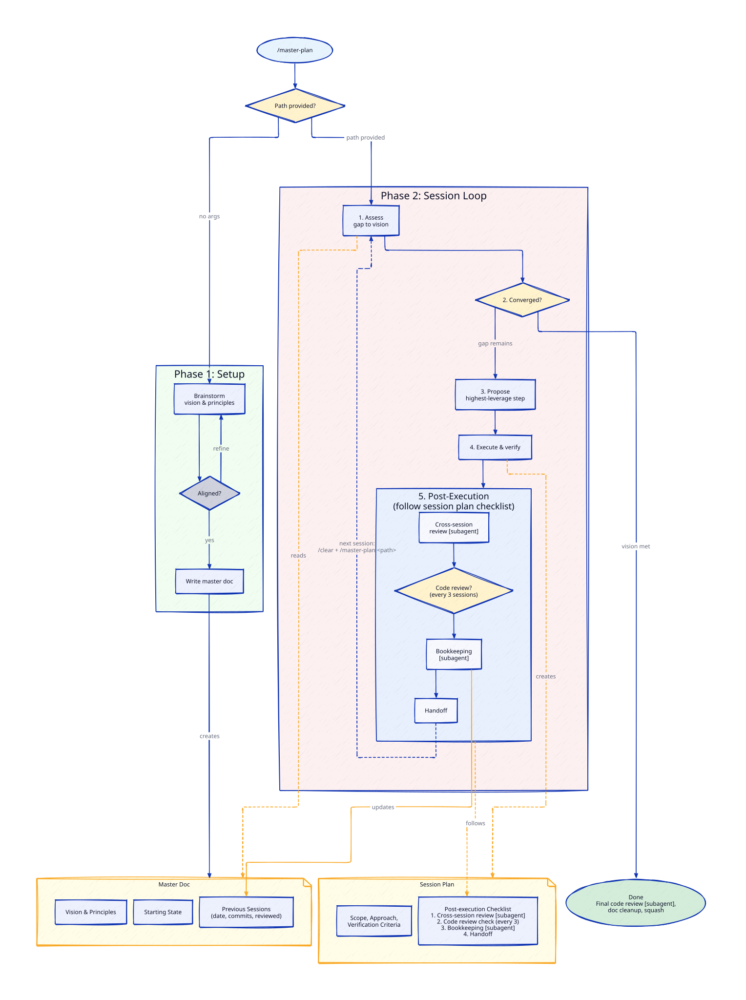

# claude-master-plan

A Claude Code plugin for tracking and executing large goals across multiple sessions.

## What it does

Master Plan gives Claude Code a structured workflow for goals that span multiple sessions and `/clear` boundaries. It maintains a "master doc" that captures the vision, principles, and session history, then uses a disciplined assess-propose-execute loop each session.

### Key features

- **Vision-driven**: Starts with collaborative brainstorming to define what "done" looks like
- **Fresh assessment each session**: No stale priority lists -- reassesses the gap every time
- **Design compliance checks**: Detects when implementation drifts from principles or design specs, and proposes design sessions when structural assumptions are unwritten
- **Convergence detection**: Proactively recommends stopping when the vision is substantially met
- **Mandatory code review**: Every session's diff is reviewed automatically
- **Parallel execution**: Independent tracks run in isolated worktrees, verify before merging -- user chooses when to parallelize
- **Mandatory consistency checks**: Catches documentation drift and pattern inconsistencies every session
- **Master doc coherence reviews**: Every 5 sessions, condenses verbose history and flags contradictions
- **Domain-agnostic**: Works for code, docs, prompts, processes -- anything

## Runtimes

- **Claude Code (primary).** Full workflow: brainstorming to create a plan, parallel tracks, subagent-dispatched bookkeeping, automated consistency/review/coherence cadences, bridge for context handoff across `/clear`. Install instructions below.
- **Codex (secondary, v1).** Linear-loop subset for continuing an existing plan. See [`codex/README.md`](codex/README.md) for install and the full subset list.

Both runtimes produce master docs in the same format — a plan started in one can be continued in the other.

## Install

```bash
# Add the marketplace
claude plugin marketplace add lcguerrerocovo/claude-master-plan

# Install the plugin
claude plugin install master-plan@claude-master-plan
```

## Usage

```
/master-plan                     # Start a new goal or list existing ones
/master-plan path/to/master.md   # Continue an existing goal
```

### Workflow



1. **Setup**: `/master-plan` starts a brainstorming dialogue to define your vision and principles
2. **Execute**: Each session reads the master doc, assesses the gap, proposes the highest-leverage next step, and executes
3. **Converge**: When the vision is substantially met, the skill recommends stopping and guides final cleanup

### Configuration

Add a `Master plans directory` entry to your project's `CLAUDE.md` to control where master docs are stored:

```markdown
- **Master plans directory:** `docs/master-plans/`
```

If not specified, defaults to `docs/master-plans/` relative to the project root.

## License

MIT
